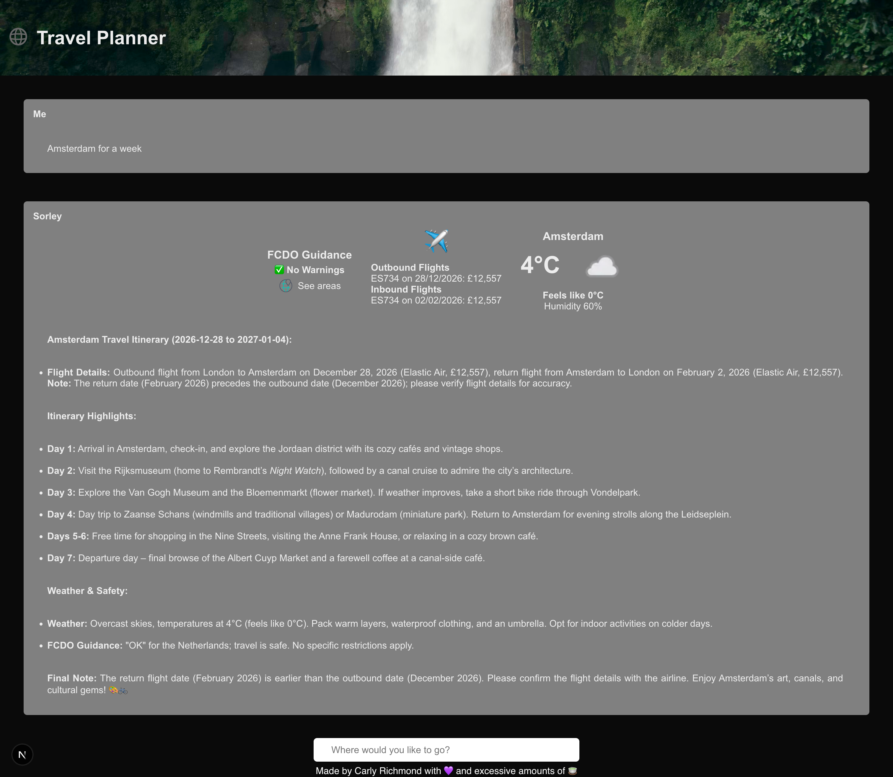

# Context Engineering AI Agent

Example Travel Planner Application Showing context engineering practices, built using AI SDK by Vercel and Elasticsearch.



## Prerequisites

To run this example, please ensure prerequisites listed in the repository [README](https://github.com/carlyrichmond/travel-planner-ai-agent) are performed:

1. Please ensure you have the following tools installed:
- Node.js
- npm

To check you have Node.js and npm installed, run the following commands:

```zsh
node -v
npm -v
```

*Please ensure that you are running Node v20.13.1 or higher*

2. Create an Elasticsearch deployment via [one of these options](https://www.elastic.co/docs/deploy-manage).
   
3. Create an Azure OpenAI resource and deployment for model *gpt-4o* via [these instructions](https://learn.microsoft.com/en-us/microsoft-cloud/dev/tutorials/openai-acs-msgraph/02-openai-create-resource). Alternatively, you can register for an API key for OpenAI [as documented here](https://help.openai.com/en/articles/4936850-where-do-i-find-my-openai-api-key) and change the [Azure provider `@ai-sdk/azure`](https://ai-sdk.dev/providers/ai-sdk-providers/azure) to the [OpenAI provider `@ai-sdk/openai`](https://ai-sdk.dev/providers/ai-sdk-providers/openai).

4. Create an account and API key for the [Weather API](https://www.weatherapi.com/). Optionally, you can substitute your own weather data in [`weatherTool`](./src/app/ai/weather.tool.ts).

5. Additionally, if you wish to run the structured output example exposed via the `/api/itinerary` endpoint, install [Ollama](https://ollama.com/) and pull the [`qwen3:8b` model](https://ollama.com/library/qwen3) locally.

## Install & Run

Pull the required code from the accompanying content repository and start the project:

```zsh
git clone https://github.com/carlyrichmond/travel-planner-ai-agent.git
```

Populate the `.env` file with your OpenAI key, Weather API key, Elasticsearch endpoint and Elasticsearch API key as per the below example, also available in [.example-env](.example-env):

```zsh
AZURE_OPENAI_RESOURCE_NAME=my-resource-name
AZURE_OPENAI_API_KEY=AzureRandomKey?
WEATHER_API_KEY=MyWeatherKey!
ELASTIC_ENDPOINT=https://my-random-elastic-deployment:123
ELASTIC_API_KEY=ARandomKey!
```

Once these keys have been populated, you can use [`direnv`](https://direnv.net/) or an equivalent tool to load them. Note that `.env` file detection requires explicit configuration using the [`load_dotenv` option](https://direnv.net/man/direnv.toml.1.html#codeloaddotenvcode) as covered [here](https://dev.to/charlesloder/tidbit-get-direnv-to-use-env-5fkn).

Load the sample flight data using [`tsx`](https://www.npmjs.com/package/tsx) or [`ts-node`](https://www.npmjs.com/package/ts-node):

```zsh
direnv allow
cd src/app/scripts
npx tsx ingestion.ts
```

Initialize and start the application:

```zsh
npm install # key dependencies: ai @ai-sdk/azure ai-sdk-ollama zod @elastic/elasticsearch
npm run dev
```

Additionally you can run the structured output example via the following cURL command:

```zsh
curl --header "Content-Type: application/json" \
  --request POST \
  --data '{"origin":"London","destination":"Berlin"}' \
  http://localhost:3000/api/itinerary
```

## Resources

 1. [Building AI Agents with AI SDK and Elastic | Carly Richmond @ Elasticsearch Labs](https://www.elastic.co/search-labs/blog/ai-agents-ai-sdk-elasticsearch)
 2. [What is Context Engineering | Carly Richmond @ Elasticsearch Labs](https://www.elastic.co/search-labs/blog/context-engineering-overview)
 3. [12-Factor Agents - Principles for building reliable LLM applications | Dexter Horthy](https://github.com/humanlayer/12-factor-agents?tab=readme-ov-file)
 4. [How to Fix Your Context | Drew Breunig](https://www.dbreunig.com/2025/06/26/how-to-fix-your-context.html)
 5. [The Prompt Report: A Systematic Survey of Prompt Engineering Techniques | Schulhoff et al.](https://arxiv.org/pdf/2406.06608)
 6. [Prompt Engineering Guide](https://www.promptingguide.ai/)
 7. [What is Memory | LangChain](https://langchain-ai.github.io/langgraphjs/concepts/memory/#what-is-memory)
 8. [Managing Agentic Memory with Elasticsearch | Som Mohankumar @ Elasticsearch Labs](https://www.elastic.co/search-labs/blog/agentic-memory-management-elasticsearch)
 9. [Don’t Build Multi-Agents | Cognition](https://cognition.ai/blog/dont-build-multi-agents#a-theory-of-building-long-running-agents)
 10. [Structured Outputs | LangChain](https://js.langchain.com/docs/concepts/structured_outputs/)
 11. [RAG-MCP: Mitigating Prompt Bloat in LLM Tool Selection via Retrieval-Augmented Generation | Gan and Sun](https://arxiv.org/pdf/2505.03275)
 12. [Why Language Models Hallucinate | OpenAI](https://cdn.openai.com/pdf/d04913be-3f6f-4d2b-b283-ff432ef4aaa5/why-language-models-hallucinate.pdf)